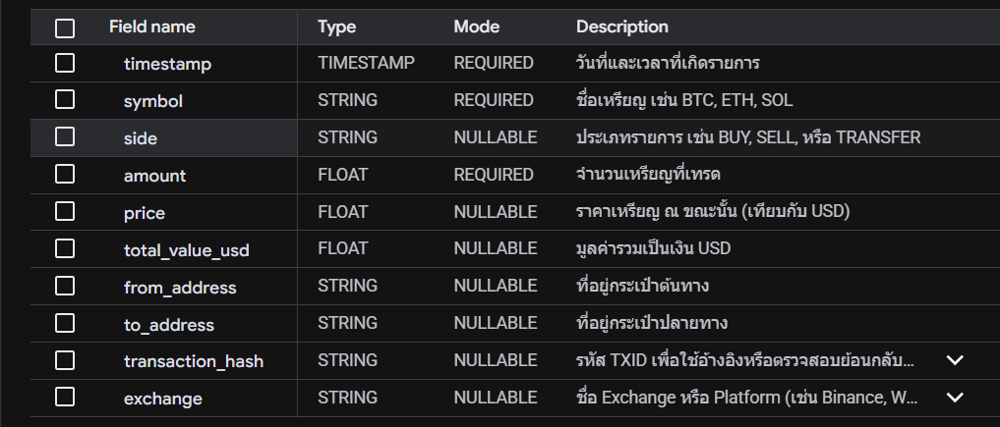
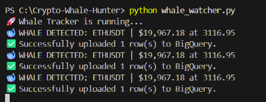
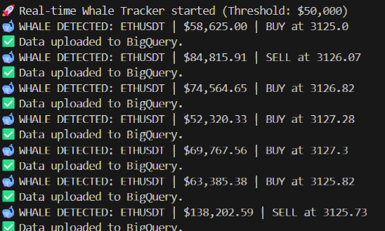
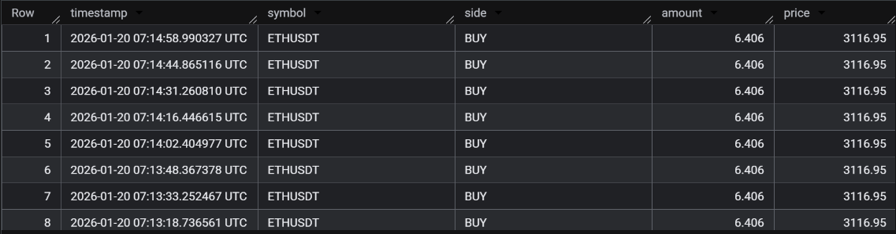
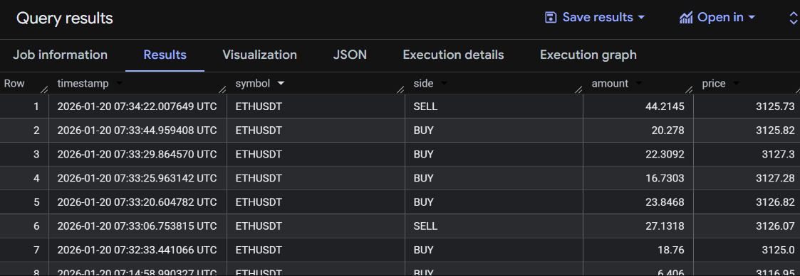

# 🐋 Crypto Whale Hunter: Real-time Data Pipeline

A high-performance, real-time data pipeline designed to ingest, process, and analyze "Whale" transactions (large-scale trades) from the cryptocurrency market. This project demonstrates the **ELT (Extract, Load, Transform)** pattern using modern cloud data warehousing practices on Google Cloud Platform.

---

## 🏗️ System Architecture

The pipeline follows a robust 4-stage process:

1.  **Ingestion (Extract):** A Python-based service connects to the **Binance WebSocket API** to stream live trade data for major assets.
2.  **Storage (Load):** Raw data is filtered for high-value transactions and batch-inserted into **Google BigQuery** using the **Batch Load (Job)** API to bypass Sandbox/Free Tier limitations.
3.  **Transformation (Transform):** Analytical logic is handled within the data warehouse using **SQL Views** to calculate market momentum and net flows.
4.  **Visualization:** A live **Looker Studio** dashboard connects to the BigQuery views to provide actionable insights.

---

## 🛠️ Tech Stack

| Component          | Technology                               |
| :----------------- | :--------------------------------------- |
| **Language** | Python 3.11+                             |
| **Data Warehouse** | Google BigQuery                          |
| **Authentication** | Google Service Account (JSON Key)        |
| **Database Ops** | BigQuery Batch Load API                  |
| **Visualization** | Google Looker Studio                     |

---

## 📋 Database Schema & Design

The table is designed for cost-efficiency and performance, utilizing **Partitioning** on the `timestamp` field to reduce query costs and increase scan speeds.


*Figure 1: Table schema definition and data types in BigQuery.*

---

## 🚀 Execution & Real-time Tracking

The ingestion engine monitors market events in real-time. When a "Whale" transaction is detected, it is immediately prepared and uploaded to the cloud with automated job status verification.

<!--  -->

*Figure 2: Real-time terminal output showing detection and successful cloud upload.*

---

## 📊 Final Results in BigQuery

Data is stored in a structured format, enabling deep-dive SQL analysis and seamless integration with Business Intelligence (BI) tools.

```
SELECT * FROM `crypto_ds.raw_whale_trades` ORDER BY timestamp DESC LIMIT 10
```

<!--  -->

*Figure 3: Verified whale trade records successfully stored in BigQuery.*
